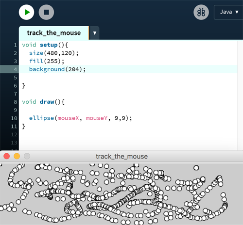
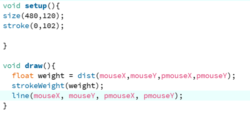
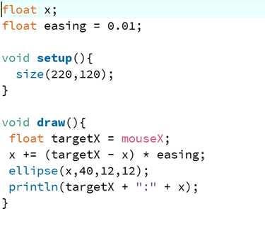

# Response

## Responsive drawing in Processing 

Code that responds to input from the mouse, keyboard, and other devices has to run continuously. To make this happen, place the lines that update inside de **draw()** function. The code within the **draw()** block runs from top to botoom, then repeats until you quit the program. 

1. ### Example: The draw() Function

To see how **draw()** works, run this example:

When the code is run, the following is written to the console.

I'm drawing 
1 
I'm drawing 
2 
I'm drawing 
3 
... 

2. ### The setup() Function

To complement the looping **draw()** function, Processing has a function called **setup()** that runs just once when the program starts.

3. ### Follow
    * Track the Mouse 
    
    The mouseX variable stores the x coordinate, and the mouseY variable stores the y coordinate.  
    
      
    
    Place the **background()** function to the begining of **draw()** before the shape is drawn. 

      
    
    * Draw continuously 
    
    The **pmouseX** and **pmouseY** variables store the position of the mouse at the previous frame. When combined with **mouseX** and **mouseY** variables, they can be used to draw continuous lines.
    
       
     
       
     
    * Set Line Thikness 
    
    The **pmouseX** and **pmouseY** variables can also be used to calculate the speed of the mouse. This is done by measuring the distance between the current and most recent mouse location. If the mouse is moving slowly, the distance is small but if the mouse starts moving faster, the distance grows. A function called **dist()** simplifies this calculation. 
    Here, the speed of the mouse is used to set the thikness of the drawn line.
       
       
    
    * Easing Does it
    Easing allows the values asigned to follow the mouse loosely- to lag behind to create a more fluid motion. With easing there are two values: The current value and the value to move toward.  
       
     
     
5. ### Click 

    * Click the Mouse
    * Detect when not clicked
    * Multiple Mouse Buttons

6. ### Location

    * Find the Cursor

7. ### Type

    * Tap a Key
    * Check for Especific Keys 
    * Move with arrow keys

