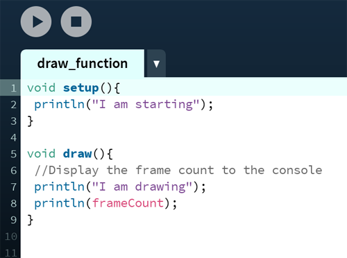

# Response

## Responsive drawing in Processing 

Code that responds to input from the mouse, keyboard, and other devices has to run continuously. To make this happen, place the lines that update inside de **draw()** function. The code within the **draw()** block runs from top to botoom, then repeats until you quit the program. 

1. ### Example: The draw() Function

To see how **draw()** works, run this example:

You will see the following:
* I'm drawing
* 1
* I'm drawing
* 2
* I'm drawing
* 3
* ...

2. ### The setup() Function
To complement the looping **draw()** function, Processing has a function called **setup()** that runs just once when the program starts

3. ### Follow

As Kanye West said:

>

    * Track the Mouse
    * Draw continuously
    * Set Line Thikness
    * Easing Does it

5. ### Click 

    * Click the Mouse
    * Detect when not clicked
    * Multiple Mouse Buttons

6. ### Location

    * Find the Cursor

7. ### Type

    * Tap a Key
    * Check for Especific Keys 
    * Move with arrow keys

